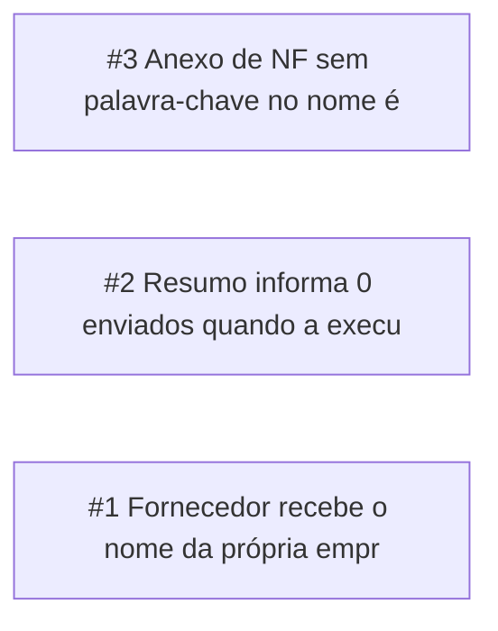

<!-- GENERATED, DO NOT EDIT: regenerado por /reversa-debugger-graph em 2026-09-22T13:45:00-03:00 a partir de 3 bugs -->
# Grafo · email-nf-onedrive

## Clusters

Nenhum cluster: os três bugs estão em módulos distintos (envio, execucao, coleta) e não compartilham código nem spec.

## Impact score

Heurística de triagem, que não substitui priority e severity: `causados*3 + bloqueados*2 + regressões*4 + relacionados*1`, só com arestas supported ou confirmed.

| bug | score |
|---|---|
| BUG-20260922-2FVK | 0 |
| BUG-20260922-RWDA | 0 |
| BUG-20260922-VBJD | 0 |
